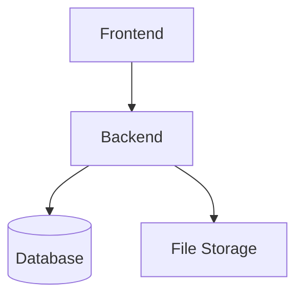

# Docker Deployment

This directory contains all Docker-related configurations and scripts for deploying the hybrid Next.js + FastAPI system.

## 📁 Directory Structure

```
docker/
├── docker-compose.yml          # Production deployment
├── docker-compose.dev.yml      # Development with hot reload
├── docker-compose.prod.yml     # Production optimized
├── frontend/
│   └── Dockerfile             # Next.js build configuration
├── backend/
│   └── Dockerfile             # FastAPI build configuration
└── scripts/
    ├── build.sh               # Build all Docker images
    ├── deploy.sh              # Deploy to production
    └── test.sh                # Run deployment tests
```

## 🚀 Quick Start

### Development Environment

```bash
# Start development environment with hot reload
cd docker
docker-compose -f docker-compose.dev.yml up --build
```

### Production Deployment

```bash
# Deploy to production
cd docker
./scripts/deploy.sh
```

### Build Images Only

```bash
# Build all Docker images
cd docker
./scripts/build.sh
```

### Run Tests

```bash
# Test the Docker setup
cd docker
./scripts/test.sh
```

## 📋 Environment Configurations

### Development (`docker-compose.dev.yml`)

- **Hot reload** enabled for both frontend and backend
- **Source code mounting** for live development
- **Debug logging** enabled
- **Volume mounts** for real-time code changes

### Production (`docker-compose.prod.yml`)

- **Optimized builds** for performance
- **Multi-stage builds** to reduce image size
- **Health checks** for service reliability
- **Standard HTTP ports** (80 for frontend, 8000 for backend)
- **Restart policies** for fault tolerance

## 🔧 Configuration Details

### Environment Variables

#### Frontend (Next.js)

```bash
NEXT_PUBLIC_API_URL=http://backend:8000/api/v1    # FastAPI API endpoint
NEXT_PUBLIC_FASTAPI_URL=http://backend:8000       # Direct FastAPI access
NODE_ENV=production                                # Environment mode
```

#### Backend (FastAPI)

```bash
DATABASE_URL=sqlite:///./app.db                    # Database connection
UPLOAD_DIR=./uploads                               # File upload directory
BIWASE_BASE_URL=https://biwase.com.vn/...          # Crawler target URL
CRAWL_TIMEOUT=30                                   # Request timeout (seconds)
CRAWL_MAX_CONCURRENT=5                             # Max concurrent requests
CRAWL_DELAY=1.0                                    # Delay between requests
DEBUG=false                                        # Debug mode
```

### Port Mapping

| Service  | Development | Production | Internal |
| -------- | ----------- | ---------- | -------- |
| Frontend | 3000        | 80         | 3000     |
| Backend  | 8000        | 8000       | 8000     |

### Volumes

- **uploads**: Persistent storage for uploaded files
- **Source mounts** (dev only): Live code reloading

## 🐳 Docker Images

### Frontend Image (`search-rag-frontend`)

- **Base**: Node.js 18 Alpine
- **Build**: Multi-stage (deps → builder → runner)
- **Features**: Standalone Next.js build, optimized for production

### Backend Image (`search-rag-backend`)

- **Base**: Python 3.11 Slim
- **Build**: Single-stage with system dependencies
- **Features**: FastAPI with Uvicorn, health checks

## 📊 Health Checks

Both services include comprehensive health checks:

### Frontend Health Check

```bash
curl http://localhost:3000/api/health
```

### Backend Health Check

```bash
curl http://localhost:8000/health
```

## 🔄 Service Dependencies



- **Frontend** depends on **Backend** being healthy
- **Backend** initializes database and file storage on startup
- Services communicate via Docker network

## 🛠️ Troubleshooting

### Common Issues

#### Services won't start

```bash
# Check Docker logs
docker-compose -f docker/docker-compose.dev.yml logs

# Check service health
docker ps
```

#### Port conflicts

```bash
# Check what's using ports
lsof -i :3000
lsof -i :8000

# Kill conflicting processes
sudo fuser -k 3000/tcp
sudo fuser -k 8000/tcp
```

#### Build failures

```bash
# Clean build cache
docker system prune -f

# Rebuild without cache
docker-compose -f docker/docker-compose.dev.yml build --no-cache
```

### Logs and Debugging

```bash
# View all logs
docker-compose -f docker/docker-compose.dev.yml logs -f

# View specific service logs
docker-compose -f docker/docker-compose.dev.yml logs backend

# Access container shell
docker-compose -f docker/docker-compose.dev.yml exec backend bash
```

## 🔐 Security Considerations

### Production Deployment

- Use **secrets management** for sensitive environment variables
- Configure **SSL/TLS** certificates for HTTPS
- Implement **network security** policies
- Use **non-root users** in containers (already configured)

### Development

- Debug mode enabled for detailed logging
- Source code mounted for hot reload
- CORS configured for local development

## 📈 Monitoring

### Health Endpoints

- `GET /health` - Basic service health
- `GET /api/health` - Cross-service health check

### Metrics

- Container resource usage (`docker stats`)
- Application logs (`docker-compose logs`)
- Health check status

## 🚀 CI/CD Integration

The Docker setup is designed for easy CI/CD integration:

```yaml
# Example GitHub Actions workflow
- name: Build and test
  run: |
    cd docker
    ./scripts/test.sh
    ./scripts/build.sh

- name: Deploy to production
  run: |
    cd docker
    ./scripts/deploy.sh
```

## 📚 Additional Resources

- [Docker Compose documentation](https://docs.docker.com/compose/)
- [Next.js deployment guide](https://nextjs.org/docs/deployment)
- [FastAPI deployment guide](https://fastapi.tiangolo.com/deployment/)
- [Docker best practices](https://docs.docker.com/develop/dev-best-practices/)
